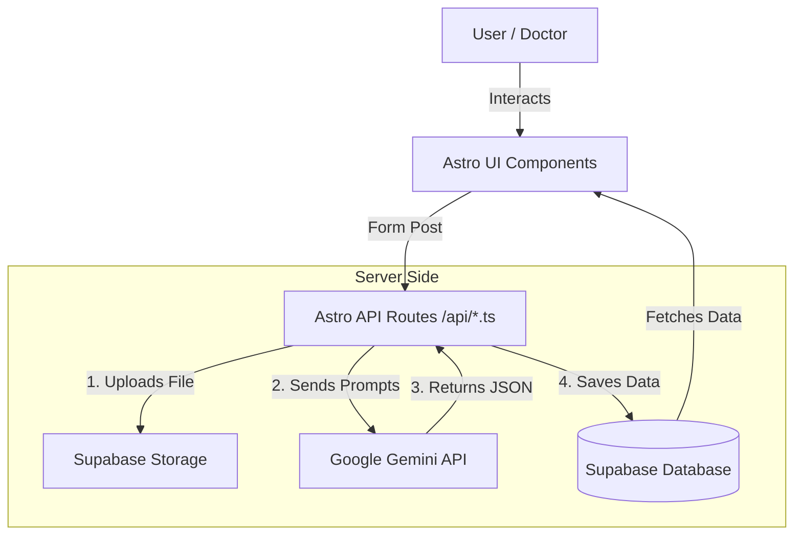

# System Architecture

## High-Level Overview

The Medical AI application follows a modern server-side rendering (SSR) architecture using **Astro**. It interfaces with **Google Gemini** for intelligence and **Supabase** for persistence.

## Database Schema

The database is designed with a relational structure (`medicalai` schema) focusing on Patients, Visits, and Reports.

### 1. Patients Table (`medicalai.patients`)
The core identity record.
- **id**: UUID (Primary Key)
- **full_name**: Text
- **contact_info**: JSONB
- **chronic_conditions**: Array of Text
- **allergies**: Array of Text

### 2. Clinical Visits (`medicalai.clinical_visits`)
Tracks specific interactions. This is the source of truth for vitals graphing.
- **id**: UUID
- **patient_id**: Ref -> Patients
- **visit_type**: 'consultation', 'follow_up', etc.
- **Vitals**: `weight_kg`, `bp_systolic`, `bp_diastolic`, `temperature_f`.
- **doctor_diagnosis**: Text

### 3. Medical Reports (`medicalai.medical_reports`)
Stores the artifacts and AI analysis results.
- **id**: UUID
- **visit_id**: Ref -> Clinical Visits
- **patient_id**: Ref -> Patients
- **report_type**: 'blood', 'scan', etc.
- **ai_analysis_json**: JSONB (The full structured output from Gemini)
- **file_url**: Link to the file in Supabase Storage.

## Security & Data Flow

### Authentication
- Uses **Supabase Auth**.
- Currently, the demo allows public access, but RLS policies are in place (though set to `true` for demo purposes) to allow for easy lockdown in production.

### Data Privacy
- **Gemini API**: Data sent to Gemini is for processing. Ensure compliance with Google's specific healthcare data policies when moving to production.
- **Supabase**: Data is stored encrypted at rest.

### API Layer
- API routes in `src/pages/api/*` run on the server (Node.js adapter).
- `GEMINI_API_KEY` is never exposed to the client.
