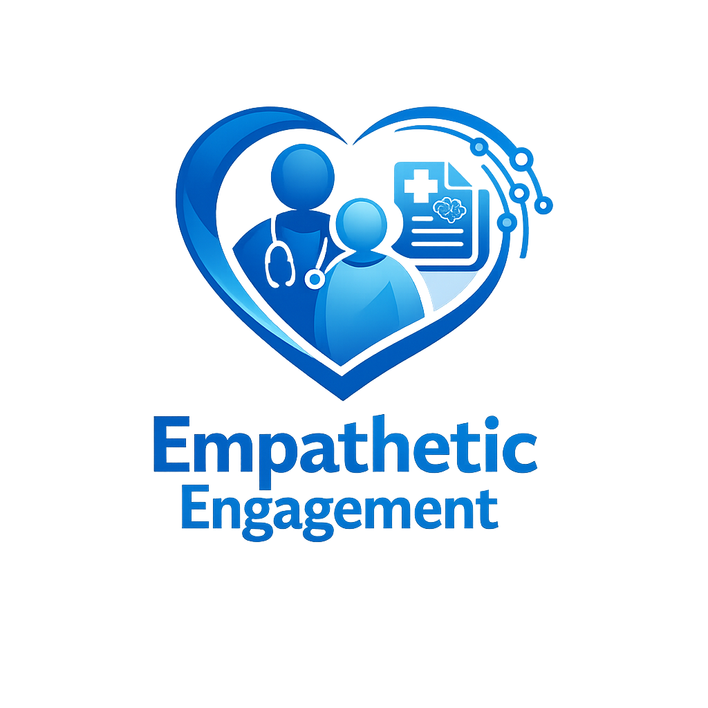

<div align="center">
  
</div>

# Empathetic Engagement: Bringing MedGemma to the Point of Care
## 1. Introduction & Problem Statement

In India, the average doctor–patient consultation lasts only 30 - 40 minutes.
In that limited time, diagnosis happens—but understanding does not.

Patients often leave the clinic with:
- A prescription they cannot interpret
- A condition they cannot explain
- Instructions they may not follow

This communication gap leads to poor treatment adherence, repeat visits, complications, and avoidable health risks. 
**Empathetic Engagement** solves this problem at the point of care.

Using the reasoning power of Google MedGemma, our system transforms raw medical inputs—scans, lab reports, and clinical notes—into structured, meaningful insights. It acts as a bridge between medical intelligence and human understanding.

Because when patients understand their condition, they follow treatment. And when treatment is followed, outcomes improve.

## 2. Application Architecture & MedGemma Integration
Empathetic Engagement is built with a modern, fast, and scalable stack:
- **Frontend:** Astro and React, styled with Tailwind CSS for a premium, responsive user interface.
- **Backend/API:** Server-side API endpoints (via Astro/Node.js) to securely handle communication with the MedGemma model.
- **Database:** Supabase (PostgreSQL) for secure, structured data storage (patient records, analysis reports, clinical histories).

### The Engine: A Two-Stage Pipeline
To achieve the best results and demonstrate reproducible code for our initial results, Empathetic Engagement utilizes a powerful two-stage pipeline:
1. **Raw Medical Extraction (Vision):** We utilize `models/gemini-2.5-pro` to perform high-accuracy OCR and strict feature extraction from uploaded medical documents (Blood Reports, X-Rays, Ultrasound scans). This model acts solely to reliably digitize complex medical imagery into structured JSON.
2. **Clinical Synthesis (MedGemma):** The extracted structured data is then passed to `models/gemma-3-27b-it` (which serves as our accessible MedGemma instance). **MedGemma is the core brain of our application.** It synthesizes the raw findings, applies medical reasoning, generates patient-friendly explanations, and flags critical clinical correlations. 

Our solution is designed for real-world healthcare:
- **Privacy-first** 
- **Multilingual** for India’s diverse population
- **Built for busy clinics** where time is limited

By separating extraction from synthesis, we ensure the MedGemma model receives clean, structured data, maximizing its reasoning capabilities, minimizing hallucinations, and allowing developers to reproduce these initial results reliably using standard API calls.

## 3. Core Features Demonstrating MedGemma

### A. Patient Portal: Empowering Understanding
- **Blood Test Analysis:** 
  Users upload raw CBC or Metabolic panel data. MedGemma analyzes the results, identifies out-of-range values, and explains their significance in plain, empathetic language. It generates a comprehensive "Health Score" and actionable, lifestyle-tailored recommendations (e.g., culturally specific dietary plans).
- **Medical Scan Interpretation:**
  Users upload radiology scans (X-Ray, MRI, Ultrasound). The system extracts the visual findings, and MedGemma breaks down the complex medical jargon. Crucially, it provides a "Patient Summary" for reassurance alongside a highly technical "Doctor Summary" for clinical use.

### B. Doctor Portal: Streamlining Clinical Workflows
- **Comprehensive Patient Profiles:**
  Doctors can create and manage detailed patient profiles, tracking vital metadata like age, gender, blood type, chronic conditions, and allergies. This context is critical for personalized diagnosis generation.
- **Diagnostic Comparison & Second Opinions (Batched Evidence):**
  The "Doctor-Assisted AI" feature allows clinicians to input patient vitals, their initial clinical hypothesis, and sequentially upload **batched streams of supporting evidence** (e.g., multiple X-rays, multi-page blood reports, and prescription notes). The pipeline synchronously ingests all unstructured files.
  It generates a "Deviation Score," explicitly highlighting areas where the evidence either *supports* or *contradicts* the doctor's initial assessment, acting as a tireless second set of eyes to prevent cognitive bias.

### C. Aligned Outputs: Bridging the Gap
This two-stage approach creates dual aligned outputs from the same set of empirical data:

**For Clinicians:**
- High-signal clinical summaries.
- Key abnormalities explicitly highlighted.
- A Deviation Score flagging potential cognitive bias or overlooked findings.
- Faster, more confident decision-making.

**For Patients:**
- A simple, empathetic explanation of their condition.
- Step-by-step treatment understanding.
- Local-language, culturally appropriate guidance.
- Clear next actions and lifestyle advice.

This creates technical clarity for doctors, and emotional, practical clarity for patients.

## 4. Prompt Engineering Techniques
To harness MedGemma effectively in a healthcare setting, we employed several prompt engineering techniques:
- **Persona Adoption:** Prompts explicitly declare "You are MedGemma (Medical Generative Multi-modal Assistant)" to anchor the model's tone to be professional, clinical, yet empathetic when addressing patients.
- **Strict JSON Enforcement:** We use zero-shot prompts with exhaustive JSON schemas. This ensures the output can be perfectly parsed to drive dynamic React components on the frontend (e.g., status badges, severity flags, formatted lists).
- **Mandatory Multilingual Support:** To demonstrate global applicability, we prompt MedGemma to always provide a summary in Tanglish/Tamil, proving its utility for diverse patient populations.
- **Conservative Guardrails:** The prompts instruct the model to report "potential clinical correlations" rather than definitive diagnoses, aligning with responsible AI practices in medicine.

## 5. Running the Code Reproducibly
Our codebase is designed to be easily reproducible.

### Prerequisites
- Node.js (v18+)
- A Supabase Account (Free tier is sufficient)
- A Google Gemini API Key (with access to `gemini-2.5-pro` and `gemma-3-27b-it`)

### Setup Instructions
1. **Clone the repository:**
   ```bash
   git clone <repository-url>
   cd empathetic-engagement
   ```
2. **Install dependencies:**
   ```bash
   npm install
   ```
4. **Database Setup:**
   - Create a new project in Supabase.
   - Run the provided `schema_v2_relational.sql` script in the Supabase SQL Editor to create the necessary tables (`patients`, `clinical_visits`, `medical_reports`).
   - Run the setup to create the bucket: `patient_records` (Public, no RLS needed for demo purposes).
5. **Environment Variables:**
   Create a `.env` file in the root directory and add:
   ```env
   SUPABASE_URL=your_supabase_url
   SUPABASE_ANON_KEY=your_supabase_anon_key
   PUBLIC_SUPABASE_URL=your_supabase_url
   PUBLIC_SUPABASE_ANON_KEY=your_supabase_anon_key
   GEMINI_API_KEY=your_gemini_api_key
   ```
5. **Run the Application:**
   ```bash
   npm run dev
   ```
   The application will be available at `http://localhost:4321`.

## 6. Initial Results & Reproducibility
By following the setup instructions above, judges can reproduce our initial results. Upon uploading a sample Complete Blood Count (CBC) report into the Patient Portal, the `models/gemini-2.5-pro` model successfully extracts the biomarker metrics (e.g., Hemoglobin, WBC) with near 100% fidelity.

When this structured JSON is passed to the MedGemma instance (`models/gemma-3-27b-it`), the model consistently generates:
1. **Accurate Health Scoring:** Reliably identifying abnormal markers.
2. **Culturally Tailored Dietary Plans:** Successfully adhering to instructions to generate recipes based on user-selected preferences (e.g., "South Indian" cuisine).
3. **Multilingual Patient Summaries:** Consistently outputting the comforting summary in Tamil as requested by the system prompt, demonstrating the model's global applicability.

These results are deterministic based on the provided prompts and parsing logic found in `src/pages/api/analyze-blood.ts` and `src/pages/api/analyze-scan.ts`.

## 7. Conclusion
Empathetic Engagement demonstrates that the HAI-DEF collection, particularly MedGemma, provides builders with a robust foundation for creating transformative healthcare applications. By maintaining full control over the model prompts and the associated data pipeline, developers can confidently build tools that respect patient privacy, streamline clinical workflows, and ultimately improve outcomes at the point of care.
